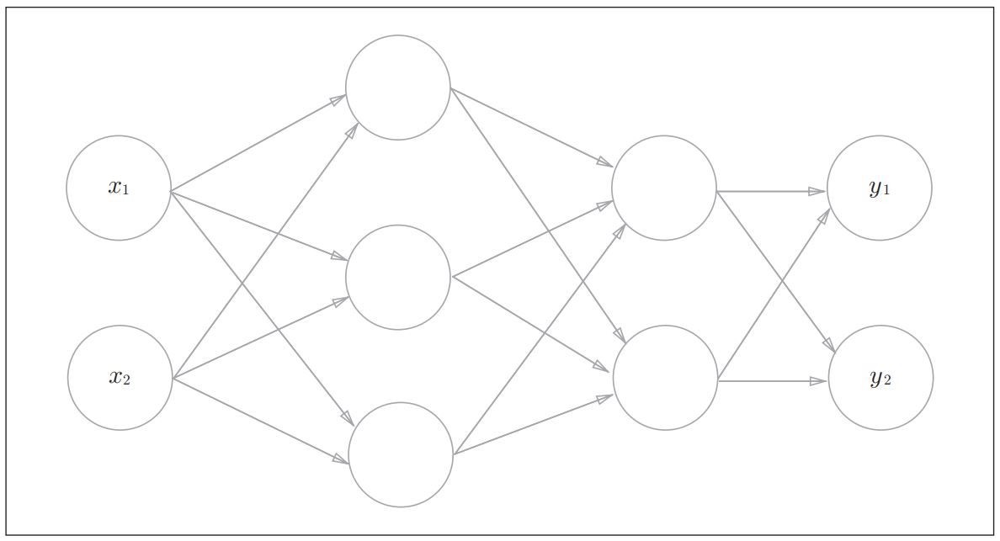
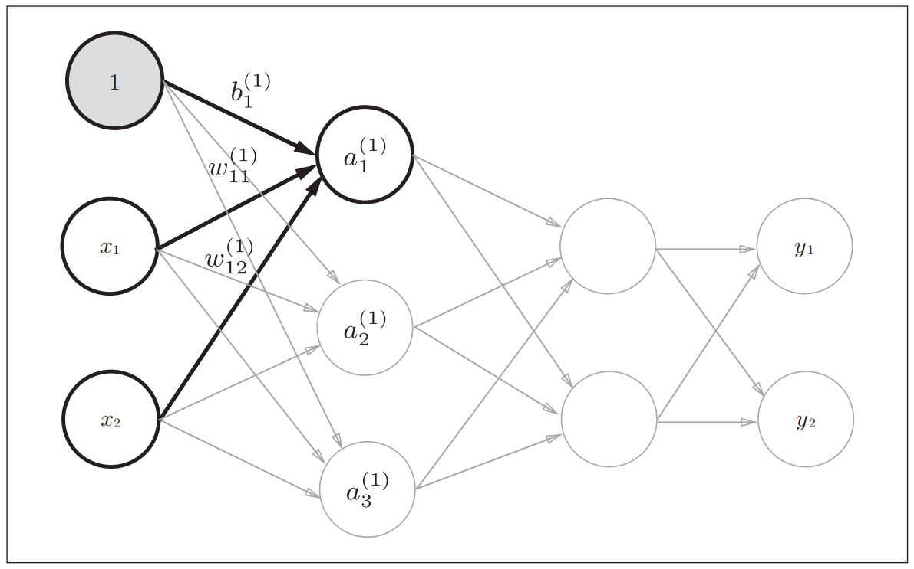

#! https://zhuanlan.zhihu.com/p/635456349
# 《深度学习入门 —— 基于Python的理论与实现》chapter3 阅读笔记

本章主要讲述如何通过numpy的array数据结构来实现神经网络的运算

以如下的神经网络为例, 输入$x_1, x_2$经过三层神经网络处理后变为$y_1, y_2$ 




从输入层到第一层神经元的处理如下图所示

$$
a^{(1)}_{1} = w^{(1)}_{11}x_1 + w^{(1)}_{12}x_{2} + b^{(1)}_{1} \\
a^{(1)}_{2} = w^{(1)}_{21}x_1 + w^{(1)}_{22}x_{2} + b^{(1)}_{2} \\
a^{(1)}_{3} = w^{(1)}_{31}x_1 + w^{(1)}_{32}x_{2} + b^{(1)}_{3}\tag{1}
$$
其中上角标(1)表示第一层，$a^{(1)}_{3}$表示第1层第3个神经元的加权值（还不是这个神经元的输出值，输出值需要对加权值经过激活函数处理）。其中权重$w$的下角标按照"后一层索引号、前一层索引号"的顺序排列。$w^{(1)}_{12}$表示第1层的第1个神经元与前一层的第2个神经元之间的权值

以上三个神经元的加权值可以写成如下矩阵形式

$$
\begin{bmatrix}
a^{(1)}_{1} \\
a^{(1)}_{2} \\
a^{(1)}_{3}
\end{bmatrix} = 

\begin{bmatrix}
w^{(1)}_{11} & w^{(1)}_{12} \\
w^{(1)}_{21} & w^{(1)}_{22} \\
w^{(1)}_{31} & w^{(1)}_{32}
\end{bmatrix}
\begin{bmatrix}
x_1 \\
x_2
\end{bmatrix} +

\begin{bmatrix}
b^{(1)}_{1} \\
b^{(1)}_{2} \\
b^{(1)}_{3}
\end{bmatrix}\tag{2}
$$

分别用$\boldsymbol{A^{(1)}}$, $\boldsymbol{W^{(1)}}$, $\boldsymbol{X}$, $\boldsymbol{B^{(1)}}$表示以上矩阵则有
$$
\boldsymbol{A^{(1)}} = \boldsymbol{W^{(1)}}\boldsymbol{X} + \boldsymbol{B^{(1)}}\tag{3}
$$

机器学习中，通常用一行代表一个样本，以上样本表示为$\boldsymbol{X}^T = [x_1, x_2]$。对公式(3)取转置得
$$
(\boldsymbol{A^{(1)}})^{T} = \boldsymbol{X}^T(\boldsymbol{W^{(1)}})^{T} + (\boldsymbol{B^{(1)}})^{T}\tag{3}
$$

由于用转置表示不美观，因此约定矩阵一行代表一个样本，因此有
$$
\boldsymbol{X} = \begin{bmatrix}x_1 & x_2 \end{bmatrix}
$$

$$
\boldsymbol{A} = \begin{bmatrix}a^{(1)}_1 & a^{(1)}_2 & a^{(1)}_3 \end{bmatrix} \\
$$

$$
\boldsymbol{B} = \begin{bmatrix}b^{(1)}_1 & b^{(1)}_2 & b^{(1)}_3 \end{bmatrix} \\
$$
$$
\boldsymbol{W} = \begin{bmatrix} w^{(1)}_{11} & w^{(1)}_{21} & w^{(1)}_{31} \\ w^{(1)}_{12} & w^{(1)}_{22} & w^{(1)}_{32}\end{bmatrix}
$$

公式(3)转化为
$$
\boldsymbol{A} = \boldsymbol{X}\boldsymbol{W} + \boldsymbol{B}\tag{4}
$$
将隐藏层的处理写成公式4的形式的一个好处是，可以直观看到从输入经过神经网络处理的过程。

```Python
import numpy as np
X = np.array([1.0, 0.5])
W = np.array([[0.1, 0.3, 0.5], [0.2, 0.4, 0.6]])
B = np.array([0.1, 0.2, 0.3])

A = np.dot(X, W) + B
```


