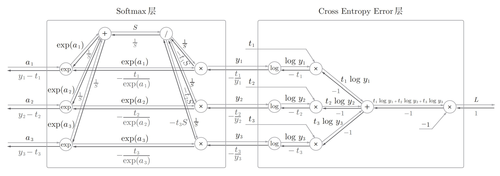
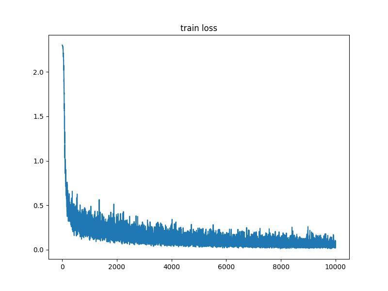

#! https://zhuanlan.zhihu.com/p/637156534
# 《深度学习入门 —— 基于Python的理论与实现》chapter5 反向传播算法的实现

第4章中介绍并实现了通过数值微分计算损失函数关于网络参数的梯度，但是运行速度非常慢，难以实际应用。本章介绍目前神经网络求梯度的常用方法反向传播。主要内容如下：
1. 通过计算图理解反向传播算法
2. 用Python实现常用神经网络模块
3. 构造神经网络，通过反向传播学习，实现手写数字识别

## 1. 计算图与反向传播
### 1.1 链式法则
对于复合函数$f(g(x))$, $f$ 关于 $x$ 的导数为 $\frac{\partial f}{\partial x}=\frac{\partial f}{\partial g}\frac{\partial g}{\partial x}$

### 1.2 计算图


如上图所示，假设橙色部分为神经网络的一个模块，该模块的参数为$\theta$, 从左向右的箭头表示正向传播(forward)，从右向左的箭头表示反向传播（backward）。假设该模块的输入为$x$，输出为$y$, 最后整个网络计算得到的损失为$L$, $\frac{\partial L}{\partial y}$为损失关于$y$的梯度，该值是从上游计算后穿过来的。此时需要计算损失关于参数$\theta$与输入$x$的梯度$\frac{\partial L}{\partial \theta}$与 $\frac{\partial L}{\partial x}$。计算$\frac{\partial L}{\partial \theta}$是为了更新参数$\theta$, 计算$\frac{\partial L}{\partial x}$是为了继续将梯度向后传播，计算之前模块的参数的梯度。根据链式法则有
$$
\frac{\partial L}{\partial \theta} = \frac{\partial L}{\partial y} \frac{\partial f}{\partial x} \\
$$

$$
\frac{\partial L}{\partial x} = \frac{\partial L}{\partial y} \frac{\partial f}{\partial \theta}
$$

$\frac{\partial L}{\partial \theta}$和$\frac{\partial L}{\partial x}$的计算都由两部分构成：$\frac{\partial L}{\partial y}$为网络上游传播过来的梯度，$\frac{\partial f}{\partial x}$与$\frac{\partial f}{\partial \theta}$为当前模块内部计算的梯度。对于计算图中的任意模块，损失关于该模块的梯度为上游传播过来的梯度乘以该模块内部的梯度。

### 1.3 计算图示例
神经网络中通常用sigmoid函数作为激活函数，对于sigmoid函数 $y = \frac{1}{1 + e^{-x}}$, 它的计算可以表示为如下计算图


假设整个网络的损失关于sigmoid模块输出$y$的梯度为$\frac {\partial L}{\partial y}$。梯度从右向左传播.

1. 从右往左数第一个节点： "/"表示函数$s = \frac{1}{t}$, $\frac {\partial s} {\partial t} = -\frac{1}{t^2}=-s^2 = -y^2$，根据1.2的规则第一个节点向下游传播的梯度为$-\frac {\partial L}{\partial y} y^2$，即


2. 从右往左数第二个节点："+"节点直接将上游的梯度不做任何操作传向下游即，


3. 从右往左数第三个节点："exp"表示函数$s = e^t$, $\frac{\partial s}{\partial t} = e^t = e^{-x}$, "exp"节点传向下游的梯度为$-\frac{\partial L}{\partial y}y^2e^{-x}$，如下图


4. 从右往左数第4个节点："×"节点关于一个乘数的梯度为另一个乘数，因此乘法节点关于输入$x$的梯度为$-1$, $\frac{\partial L}{\partial x}=-\frac{\partial L}{\partial y}y^2e^{-x} \times(-1)=\frac{\partial L}{\partial y}y^2e^{-x}$,如下图


$\frac{\partial L}{\partial y}y^2e^{-x}$可以做如下化简：
$$
\begin{aligned}
    \frac{\partial L}{\partial y}y^2e^{-x} &= \frac{\partial L}{\partial y} \frac{1}{(1 + e^{-x})^2}e^{-x} \\
&= \frac{\partial L}{\partial y}\frac{1}{1 + e^{-x}}\frac{e^{-x}}{1 + e^{-x}} \\
&=\frac{\partial L}{\partial y}\frac{1}{1 + e^{-x}}(1 - \frac{1}{1 + e^{-x}}) \\
& =\frac{\partial L}{\partial y}y(1 - y)
\end{aligned}
$$

sigmoid节点整体可以表示如下


## 2. 常用神经网络模块的实现
### 2.1 ReLU
ReLU(Rectified Linear Unit)函数是目前常用的激活函数，表示为
$$
y =\left\{
\begin{aligned}
x, {\kern 5pt} x > 0\\
0, {\kern 5pt} x \le 0
\end{aligned}
\right.
$$

$y$关于$x$的导数为
$$
\frac {\partial y}{\partial x}=\left\{
    \begin{aligned}
        1, {\kern 5pt} x > 0\\
        0, {\kern 5pt} x \le 0\\
    \end{aligned}
\right.
$$
如果输入$x > 0$, 则输出关于输入的导数为$1$, 否则为$0$。Python实现如下
```Python
class ReLU:
    def __init__(self):
        self.mask = None

    def forward(self, x):
        self.mask = (x <= 0)
        out = x.copy()
        out[self.mask] = 0 # 将小于0的部分置为0
        return out
    
    def backward(self, dout):
        dout[self.mask] = 0 # 将输入小于0的部分的梯度置为0，其他部分保持不变
        dx = dout
        return dx
```

### 2.2 Sigmoid
sigmoid函数为
$$
y = \frac{1}{1 + e^{-x}}
$$
由1.3的推导可得$y$关于$x$的导数为$\frac{\partial y}{\partial x}=y(1 - y)$

Python实现如下
```Python
class Sigmoid:
    def __init__(self):
        self.out = None
    
    def foward(self, x):
        out = 1.0 / (1 + np.exp(-x))
        self.out = out
        return out
    
    def backward(self, dout):
        dx = dout * (1.0 - self.out) * self.out
        return dx
```

### 2.3 Affine
Affine（仿射变换）层，即为一个全连接层，表示一次线性变换加一次平移，等同于pytorch的nn.Linear。即
$$
\boldsymbol{Y} = \boldsymbol{X}\boldsymbol{W} + \boldsymbol{B}
$$

计算图如下所示：


图中每个变量旁边的二元组表示该变量的形状。Affine层的梯度计算如下
$$
\frac{\partial L}{\partial W} = X^T\frac{\partial L}{\partial Y} 
$$
$$
\frac{\partial L}{\partial X} = \frac{\partial L}{\partial Y}W^T
$$

对于偏置$B$, 在前向传播的过程中通过广播机制将$B$加到$XW$的每一行得到$Y$。因此损失关于$B$的梯度需要将$\frac{\partial L}{\partial Y}$沿着扩展的方向，即第0维求和。假设$\frac{\partial L}{\partial Y}$如下：
$$
\frac{\partial L}{\partial Y} = \begin{bmatrix}
\frac{\partial L}{\partial Y_{11}}  &  \frac{\partial L}{\partial Y_{12}} & \cdots & \frac{\partial L}{\partial Y_{1k}} \\
\vdots & \vdots & \ddots & \vdots\\
\frac{\partial L}{\partial Y_{b1}} & \frac{\partial L}{\partial Y_{b2}} & \cdots & \frac{\partial L}{\partial Y_{bk}}

\end{bmatrix}
$$

对$\frac{\partial L}{\partial Y}$的每一列求和后的结果即为$\frac{\partial L}{\partial B}$。

Affine层的Python实现如下
```Python
class Affine:
    def __init__(self, W, b):
        self.W = W
        self.b = b
        self.x = None
        self.dW = None
        self.db = None
    
    def forward(self, x):
        self.x = x
        out = np.dot(x, self.W) + self.b
        return out
    
    def backward(self, dout):
        dx = np.dot(dout, self.W.T)
        self.dW = np.dot(self.x.T, dout)
        self.db = np.sum(dout, axis=0) # 沿第0维求和

        return dx
```

### 2.4 SoftmaxWithLoss

SoftmaxWithLoss就是实现pytorch中的nn.CrossEntropyLoss的功能, 将模型输入先做softmax变换，然后与标签一起计算交叉熵损失。SoftmaxWithLoss可以表示为两部分：softmax与crossentropyloss，如下图所示


将上图的计算细节表示为下图可以更容易的推导出反向传播的流程



SoftmaxWithLoss的Python实现如下
```Python
class SoftmaxWithLoss:
    def __init__(self):
        self.loss = None
        self.y = None
        self.t = None
    
    def forward(self, x, t):
        self.t = t
        self.y = softmax(x)
        self.loss = cross_entropy_error(self.y, t)
        
        return self.loss
    
    def backward(self, dout=1):
        batch_size = self.t.shape[0]
        dx = (self.y - self.t) / batch_size # 与批量大小解耦
        return dx
```
其中，softmax与cross_entropy_error在第4章已经实现过。

## 3. 通过反向传播进行学习
实现了上述的模块后，可以利用这些模块组成神经网络进行实际的学习过程。对chapter 4中实现的两层神经网络进行修改，将通过数值微分计算梯度修改为通过反向传播计算梯度。Python实现如下：
```Python
class TwoLayerNet:
    def __init__(self, 
        input_size,
        hidden_size,
        output_size,
        weight_init_std=0.01,
    ):
        self.params = {}
        self.params["W1"] = weight_init_std * np.random.randn(input_size, hidden_size)
        self.params["b1"] = np.zeros(hidden_size)
        self.params["W2"] = weight_init_std * np.random.randn(hidden_size, output_size)
        self.params["b2"] = np.zeros(output_size)

        self.layers = OrderedDict()
        self.layers["Affine1"] = Affine(self.params["W1"], self.params["b1"])
        self.layers["Relu1"] = ReLU()
        self.layers["Affine2"] = Affine(self.params["W2"], self.params["b2"])
        
        self.last_layer = SoftmaxWithLoss()

    def predict(self, x):
        for layer in self.layers.values():
            x = layer.forward(x)
        
        return x
    
    def loss(self, x, t):
        y = self.predict(x)
        loss = self.last_layer.forward(y, t)

        return loss
    
    def accuracy(self, x, t):
        y = self.predict(x)
        y = np.argmax(y, axis=1)
        if t.ndim != 1:
            t = np.argmax(t, axis=1)
        
        accuracy = np.sum(y == t) * 1.0 / x.shape[0]

        return accuracy
    
    def numerical_gradient(self, x, t):
        loss_W = lambda W: self.loss(x, t)
        grads = {}
        grads["W1"] = numerical_gradient(loss_W, self.params["W1"])
        grads["b1"] = numerical_gradient(loss_W, self.params["b1"])
        grads["W2"] = numerical_gradient(loss_W, self.params["W2"])
        grads["b2"] = numerical_gradient(loss_W, self.params["b2"])

        return grads
    
    def gradient(self, x, t):
        # forward
        self.loss(x, t)

        # backward
        dout = 1
        dout = self.last_layer.backward(dout)

        layers = list(self.layers.values())
        layers.reverse()
        for layer in layers:
            dout = layer.backward(dout)

        grads = {}
        grads["W1"] = self.layers["Affine1"].dW
        grads["b1"] = self.layers["Affine1"].db
        grads["W2"] = self.layers["Affine2"].dW
        grads["b2"] = self.layers["Affine2"].db

        return grads
```

训练函数如下
```Python
def train():
    (x_train, t_train), (x_test, t_test) = load_mnist(
        normalize=True, one_hot_label=True
    )

    network = TwoLayerNet(
        input_size=784, 
        hidden_size=50,
        output_size=10
    )

    iters_num = 10000
    train_size = x_train.shape[0]
    batch_size = 100
    learning_rate = 0.1
    train_loss_list = []
    train_acc_list = []
    test_acc_list = []
    iter_list = []

    iter_per_epoch = max(train_size / batch_size, 1)

    for i in tqdm(range(iters_num), total=iters_num):
        batch_mask = np.random.choice(train_size, batch_size)
        x_batch = x_train[batch_mask]
        t_batch = t_train[batch_mask]

        grad = network.gradient(x_batch, t_batch)

        for key in ("W1", "b1", "W2", "b2"):
            network.params[key] -= learning_rate * grad[key]
        
        loss = network.loss(x_batch, t_batch)
        train_loss_list.append(loss)

        if i % iter_per_epoch == 0:
            train_acc = network.accuracy(x_train, t_train)
            test_acc = network.accuracy(x_test, t_test)
            train_acc_list.append(train_acc)
            test_acc_list.append(test_acc)
            iter_list.append(i)
            print(f"step {i}, train_acc: {train_acc}, test_acc: {test_acc}")
```

训练损失



准确率


完整代码[DeepLearningFromScratch
](https://github.com/wflying000/DeepLearningFromScratch)

